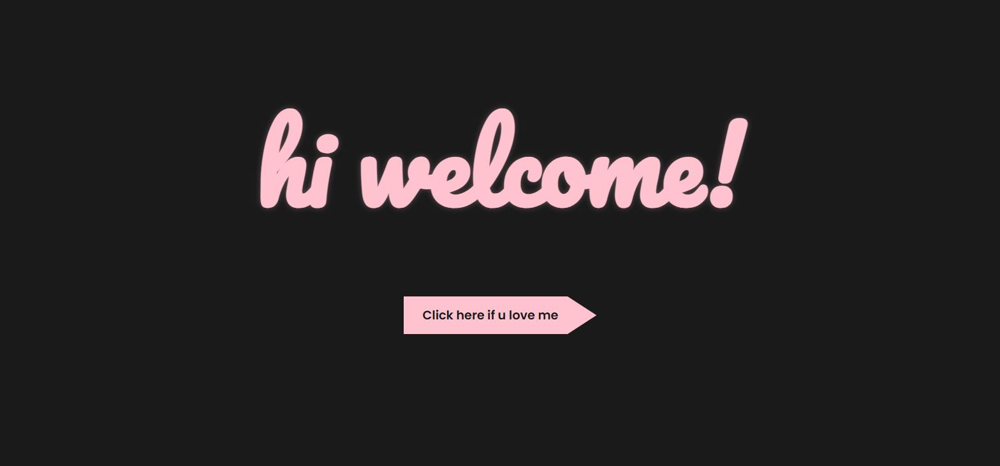
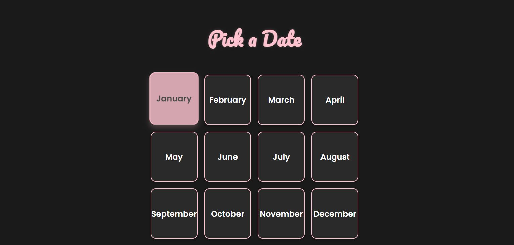
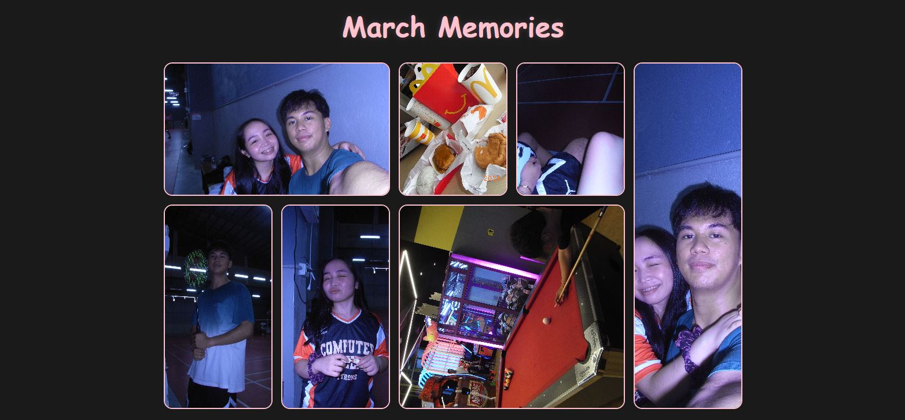

# 💌 Valentines Memory Wall Gallery

A full-stack, interactive memory photo wall built as a personal Valentine's Day gift. This web application allows the user to navigate through a cute, customized greeting flow and open a calendar to view, add, and delete memories (photos and captions) for each month.

## ✨ Features
* **Interactive UI:** A dark-mode and pastel-pink themed interface with CSS hover effects and page-sliding transitions.
* **Month-by-Month Calendar:** A grid selector to easily navigate between different months of the year.
* **Full CRUD Functionality:** Users can upload new photos with captions, view them on a Pinterest-style grid, and delete memories they no longer want.
* **Backend Database:** Powered by PHP and MySQL to ensure uploaded images and data are persistently saved locally.

## 🛠️ Tech Stack
* **Frontend:** HTML5, CSS3, Vanilla JavaScript
* **Backend:** PHP
* **Database:** MySQL (via phpMyAdmin)
* **Environment:** XAMPP Local Server

## 📸 System Screenshots
### Welcome Page


### Calendar


### Sample


---

## 🚀 How to Run Locally

Since this project relies on a PHP backend and a MySQL database, it cannot simply be opened by double-clicking the HTML file. You will need a local server environment like XAMPP to run it.

### 1. Prerequisites
* Download and install [XAMPP](https://www.apachefriends.org/index.html) (or WAMP).
* Ensure you have Git installed on your machine.

### 2. Setup the Project Files
1. Open your terminal or Git Bash.
2. Navigate to your XAMPP `htdocs` directory:
   ```bash
   cd C:/xampp/htdocs